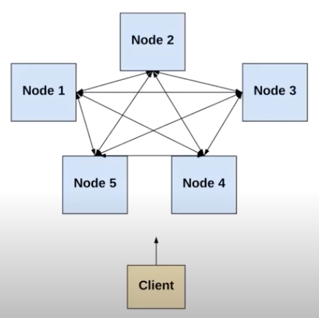
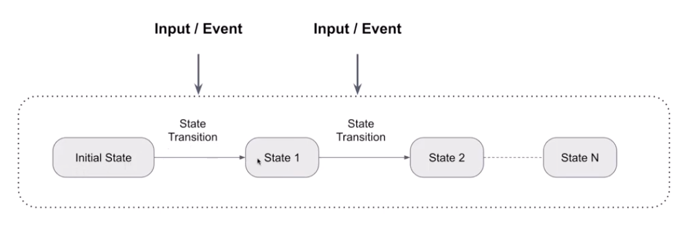
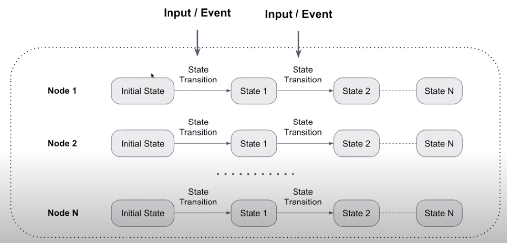
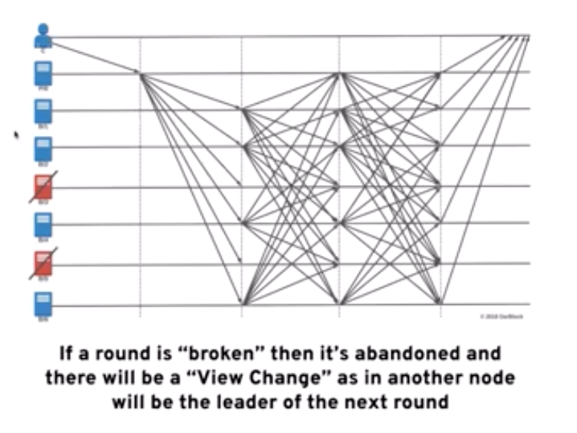
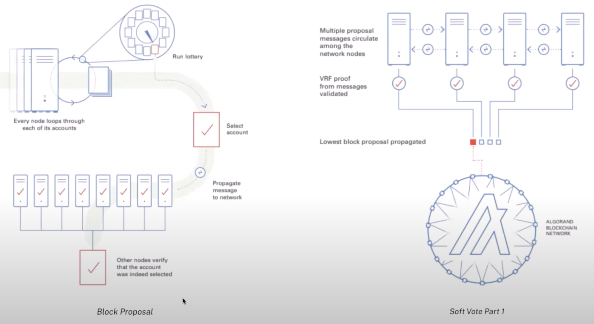
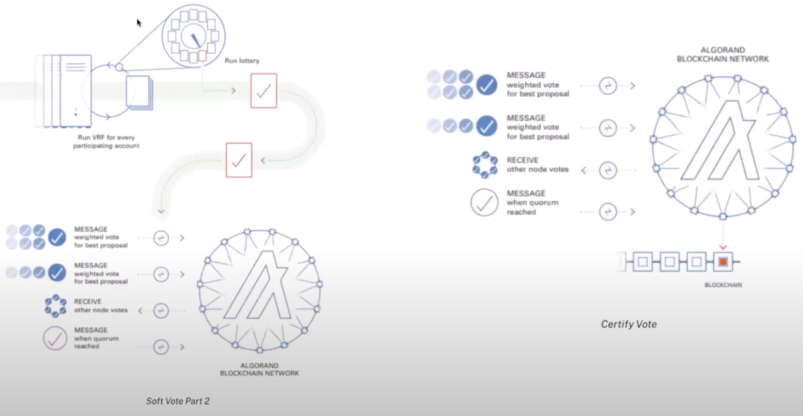
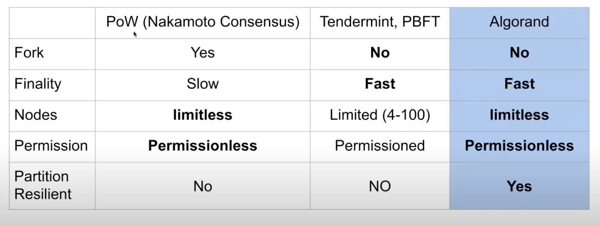

# Algorand

5. Blockchain Structure
Goal: Evaluate the blockchain structure of this project; name at least two things you like and two things you would want to improve.

- What is the state transition function of this blockchain/project?
- What are the core elements of the application stack?
- What is the anatomy of a block in this system?
- What is the consensus algorithm that is used? How does it work?

## White paper notes

6.3 The Actual Protocol Algorand ′2

pg 60

## Links

https://medium.com/insatiableminds/dissecting-algorand-e962f48f8c72#:~:text=The%20ledger%20uses%20SQLite%20database,lightweight%2C%20and%20fault%2Dtolerant.

https://www.youtube.com/watch?v=_u0lJsXky7Ys

## How to super and subscript

SV$^{r}$
SV$_{r}$

## Consensus Algorithm

Algorand is a distributed system will multiple nodes.

It has a state machine.

It is a Replicated State Machine. Which means multiple node are maintaining the same state.

### Challenges for Replicated State Machine

- There is no globally consistent clock
- Each node could be faulty
- Messages transferred in the network are not always reliable

The solution is a consensus algorithm

### Consensus Definition

- Agreement/Consistency
  - All the non-error nodes can agree on a sequence of events/transactions and generate the same output
- Termination/Liveness
  - All the non-error nodes can generate an output under a certain time

### FLP Impossibility

In an asynchronous network where messages can be delayed but not lost, there is no consensus algorithm that is guaranteed to terminate if at least one node may fail.

Hence:
- You have to be a synchronous network if you want to have termination.

## Network Model Assumption

- Asynchronous network
  - Network message delay can be indefinite
  - This is more real world

- Synchronous network
  - Network message delay is lower than a certain time
  - This is the most promising network situation

- Partial Asynchronous Network Model
  - The network is generally synchronous most of the time
  - This allows us to get past FLP impossibility

## BFT Assumptions

- 2/3 of nodes are honest

## Algorand Consensus Algorithm

- Pure Proof of Stake
  - No locked tokens
  - No punishment
  - One token stands for one piece of voting power

- Cryptographic Sortition to Choose Leader
  - Each user secretly draws a lottery through the VRF mechanism
  - A leader is selected and it's public key revealed to all; the leader then proposes a new block

- Do it again to choose a committee
  - ~1_000 tokens are randomly selected (via VRF) to form a small committee.
  - This small committee will vote twice to reach consensus.

### Cryptographic Sortition

#### Round 1

Starts by running a lottery - runs a VRF for every participating account. Every node goes through all its accounts.

Each round multiple leaders will be selected, as there will only be set a threshold for the lottery.

Each leader goes through a round of communication using VRF to prove they are the leader.

The leader with the lowest block proposal value (hash of the block) will "win" the lottery. "Lowest block protocol".

#### Round 2

Starts by running a lottery - runs a VRF for every participating account.

This forms the committee.

Then the committee send messages to each other.
- Weighted vote for best proposal
- Weighted vote for best proposal
  - So the vote is run twice
- Quorum is achieved

## Conclusion

Algorand:
- No forks
- Fast finality
- limitless nodes
- Permissionless
- Partition Resilient

## Extra points

There is no financial incentive to run nodes.
Transaction fees are burned.

