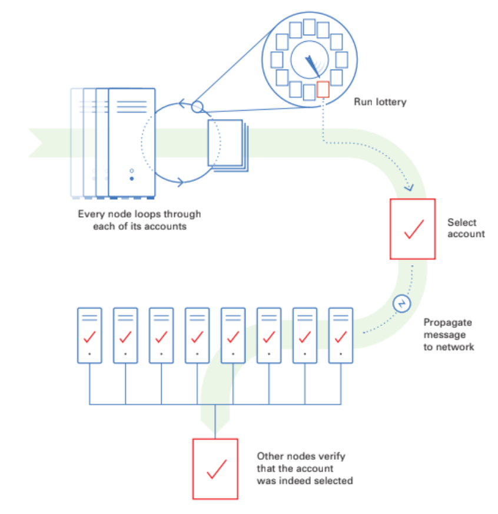
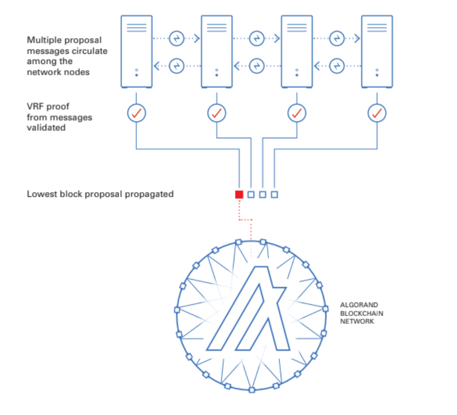

# Midterm assignment: Analysis of Algorand's Whitepaper and Technological Stack


<p align="center">University of Cambridge
Polkadot Blockchain Academy 2022</p>
<p align="center">Alexander Curtis, Felix Gate, Giulia Vieira, Jose Juan Sanz, Thomas Harper</p>

## Table of Contents

- [Midterm assignment: Analysis of Algorand's Whitepaper and Technological Stack](#midterm-assignment-analysis-of-algorands-whitepaper-and-technological-stack)
  - [Table of Contents](#table-of-contents)
  - [Introduction](#introduction)
    - [Our White Paper - Algorand](#our-white-paper---algorand)
    - [The core offerings of Algorand](#the-core-offerings-of-algorand)
    - [What does it allow users to do?](#what-does-it-allow-users-to-do)
    - [The differentiators of Algorand](#the-differentiators-of-algorand)
  - [1. Cryptography](#1-cryptography)
    - [1.1 Hashing](#11-hashing)
    - [1.2 Digital Signatures](#12-digital-signatures)
    - [1.2.1 Key Generation](#121-key-generation)
      - [1.2.1.1 Public Key](#1211-public-key)
      - [1.2.1.2 Private Key](#1212-private-key)
    - [1.2.2 Signature](#122-signature)
    - [1.2.3 Verification](#123-verification)
    - [1.3 Ephemeral Keys](#13-ephemeral-keys)
    - [1.4 Cryptographic Sortition](#14-cryptographic-sortition)
  - [2. Economics](#2-economics)
    - [2.1 Tokenomics](#21-tokenomics)
    - [2.2 Transaction Fees](#22-transaction-fees)
    - [2.3 Staking](#23-staking)
    - [2.4 Governance Rewards](#24-governance-rewards)
    - [2.5 Auctions](#25-auctions)
      - [2.5.1 Duration, Supply and Price](#251-duration-supply-and-price)
      - [2.5.2 Participants](#252-participants)
      - [2.5.3 Arriving at a Fair Price](#253-arriving-at-a-fair-price)
      - [2.5.4 Demand](#254-demand)
      - [2.5.5 Auction Finalisation](#255-auction-finalisation)
  - [3. Governance](#3-governance)
    - [3.1 An Overview of the Collective Decision Making Process](#31-an-overview-of-the-collective-decision-making-process)
    - [3.2 Method of Voting](#32-method-of-voting)
    - [3.3 Structure of Governance](#33-structure-of-governance)
    - [3.4 Utility and Legitimacy](#34-utility-and-legitimacy)
    - [3.5 Conclusion](#35-conclusion)
  - [4. Blockchain Guarantees, Threat Models and Security](#4-blockchain-guarantees-threat-models-and-security)
    - [4.1 Blockchain Guarantees](#41-blockchain-guarantees)
      - [4.1.1 Liveness and DOS attacks](#411-liveness-and-dos-attacks)
      - [4.1.2 Fairness](#412-fairness)
      - [4.1.3 Censorship-resistance](#413-censorship-resistance)
      - [4.1.4 Safety](#414-safety)
    - [4.2 Protection against threats](#42-protection-against-threats)
      - [4.2.1 Byzantine Generals Problem](#421-byzantine-generals-problem)
      - [4.2.2 51% attack](#422-51-attack)
      - [4.2.3. Sybil Attack](#423-sybil-attack)
    - [4.3. Secure transactions](#43-secure-transactions)
  - [5. Blockchain Structure](#5-blockchain-structure)
    - [5.1 State Transition Function](#51-state-transition-function)
      - [Payments](#payments)
      - [Summary](#summary)
    - [5.2 Application Stack](#52-application-stack)
      - [Storage](#storage)
      - [Network Communication](#network-communication)
      - [Smart Contracts](#smart-contracts)
    - [5.3 Block Anatomy](#53-block-anatomy)
    - [5.4 Consensus Algorithm](#54-consensus-algorithm)
      - [Round 1 - Block Proposal](#round-1---block-proposal)
      - [Round 2-3 - Block Certification](#round-2-3---block-certification)
  - [7. Conclusion](#7-conclusion)
    - [7.1 How the cryptographic elements, the economic incentives and blockchain parameters all contribute to the core goals of this blockchain](#71-how-the-cryptographic-elements-the-economic-incentives-and-blockchain-parameters-all-contribute-to-the-core-goals-of-this-blockchain)
      - [7.1.1 Environmental Sustainability](#711-environmental-sustainability)
      - [7.1.2 Scalability and Transaction Speed](#712-scalability-and-transaction-speed)
      - [7.1.3 Decentralisation and Security](#713-decentralisation-and-security)
    - [7.2 Upsides](#72-upsides)
    - [7.3 Downsides](#73-downsides)
    - [7.3 Attacking the Network](#73-attacking-the-network)
  - [8. Bibliography](#8-bibliography)

## Introduction

### Our White Paper - Algorand

- [The Algorand White Paper](https://arxiv.org/pdf/1607.01341.pdf)

### The core offerings of Algorand

Algorand provides a forkless, sustainable and scalable Pure Proof of Stake blockchain with provable/instant finality that can handle up to 1000 transactions per second.

### What does it allow users to do?

Algorand provides a global transaction layer for fast transaction settlement. It can be used for  permissionless peer-to-peer financial interaction, the generation of staking rewards and the use of smart contracts written in Python via PyTEAL, which will compile down into TEAL. This allows the creation of dApps, NFTS and security tokens.

### The differentiators of Algorand

Algorand has a few core differentiators. It is forkless, meaning finality is provided every 4.5 seconds, which is excellent for speedy transaction settlement. It also has very low transaction fees and a consensus mechanism which allows a limitless amount of nodes to participate in the staking process.
## 1. Cryptography

### 1.1 Hashing

Algorand uses SHA256 and SHA512 as their trusted hash function. The choice for SHA256 is based on the fact that a 256-bit long output is short enough to perform sufficiently efficiently in current average machines, but long enough to be secure in terms of collision resistance. Trying at random, and relying on the birthday paradox, finding two different strings x and y such that H(x) = H(y) would require 2<sup>256/2</sup> = 2<sup>128</sup> trials. As in the case of using SHA512, that is required for their digital signature scheme, explained in the next section. Then, the resulting string is double the size of SHA256, but also requires 2<sup>128</sup> more trials to be broken.

SHA512 works as follows, as SHA256, but the latter deals with half the amount of bits in all states.


### 1.2 Digital Signatures

In Algorand, a user relies on digital signatures for payments and credentials, as happens in most blockchains. Nevertheless, different from those, for the Byzantine Agreement Protocol, each step a user takes should also be signed using ephemeral keys.

As their digital signature scheme, Algorand relies on Ed25519, a form of Edwards-curve Digital Signature Algorithm where SHA-512 (SHA-2) is used as the hash function and Curve25519 is the Elliptic Curve. That means their public key has 256 bits, the signature has 512 bits and the curve provides 128 bits of security.

A digital signature scheme consists of three fast algorithms: a probabilistic key generator G, a signing algorithm S, and a verification algorithm V.

In EdDSA that works as follows:

### 1.2.1 Key Generation

Given the Finite Field Fq over odd prime power,
Elliptic Curve E over Fq whose group of Fq E(Fq) = 2c l , where l is a large prime and 2c is called the cofactor;
Base point B in E(Fq) with order l; and
Cryptographic hash function H with 2b-bit outputs, where 2b-1 > q so that elements of Fq and curve points in E(Fq) can be represented by strings of b bits.

#### 1.2.1.1 Public Key

A curve point A in E(Fq), encoded in b bits.

#### 1.2.1.2 Private Key

b-bit string k which should be chosen uniformly at random.

The as the public key is A = sB, where s= H0, ..., b-1(k) , private key is the least significant b bits of H(k) interpreted as an integer in little-endian.

### 1.2.2 Signature

Given a message M, the EdDSA signature is the tuple (R,S) encoded in 2b bits, of a curve point R in E(Fq) where

R = rB for r = H(s || M)
S ≡ r + H(R || A || M)s (mod l)

### 1.2.3 Verification

Verification passes when when
2cSB = 2cR + 2cH(R || A || M)A

Ed25519 is optimised for the [x86-64]/Westmere processor family and verification can be performed in batches of 64 signaturest. Ed25519 is intended to provide attack resistance comparable to quality 128-bit symmetric ciphers.

### 1.3 Ephemeral Keys

To achieve ephemeral keys to sign every step of Algorand's Byzantine Agreement, they make use of the user's identity, which now becomes their Public Key. For a central authority A,  A generates a Public Master Key PMK, and a corresponding secret master key, SMK. Suppose a player with identity P. A computes a secret signature  key skP via SMK, and **privately gives** skP to P. Therefore, **if** A destroys SMK and it's children P is the only one who can digitally sign messages relative to the Public Key P. 

Ephemeral keys can also be implemented without using identity-based signatures, for instance, via **Merkle trees**. Nevertheless, that was not the choice for Algorand.

### 1.4 Cryptographic Sortition

To improve the Byzantine Agreement algorithm's speed, Algorand uses cryptographic sortition to choose a small subset of the users to become verifiers. In this case, for each block a new set of verifiers is randomly selected, aiming to avoid concentration of power. 

They use cryptographic function to automatically determine, from the previous block Br-1, a leader, in charge of proposing the new block and the verifier set. Nevertheless, information regarding the previous block is not enough to ensure security, as it is in the past and, therefore, anyone can know the last non-influenciable quantity Qr−1 contained in Br−1 must be known too. 

The algorithm works as follows:


Their solution then was to secretly divide the roles and compute credentials. Therefore, when that user produces a block they spawn it together with the credentials to verification. This way, they believe that once an adversary learns about the block producer it will already be too late to corrupt him. 
## 2. Economics

### 2.1 Tokenomics

Algorand project has its own native cryptocurrency, called ALGO. At the genesis of the Algorand blockchain, 10Bn ALGO was minted. Algorand is inflationary, the tokens have been being distributed through different forms of ecosystem support and community incentives. As of March 31, 2022, the circulating supply was more than 6.7B ALGO, and the Foundation holds the remaining part in secure wallets with the following composition:

  
|ALLOCATION  |ALGO  |
|--|--|
| Community & Governance Rewards | 1757.26M |
|Ecosystem Support|1176.05M|
|Foundation Endowment|363M|

The token distribution has the purpose to incentivize the economic system built around the Algorand platform and to reward the participation to the Algorand Decentralized Governance and the contribution to the economic network activities.

For the initial period of Algorand's history, the distribution was based mainly on a number of different ecosystem programs, such as universities and grants, and on algorithmic rewards to the community, early backers, and network service providers. The main goal was decentralization and inflation control. In December 2020 the token distribution schedule was:


Since then, some of the main aspects have evolved:
- The fixing of the circulating supply computation in September 2021 has aligned the definition of the circulating supply with the market standard with an increase of 1.6B Algo with no outflow.
- The Algorithmic Vesting, with the feature of slowing down vesting while allowing accelerations based on market conditions, completed in October 2021. It has released 2.135B ALGO between the first significant acceleration in August 2020 and the completion of algorithmic vesting on October 6, 2021.
- The remaining part of the Contingent Incentives has been allocated to fuel the ecosystem growth, which is now treated as a unique fund to strengthen economic and social activities.

### 2.2 Transaction Fees

Transaction fees in Algorand are low. The minimum fee for a transaction is only 0.001 Algos.

### 2.3 Staking

Algorand uses a pure proof-of-stake (PPoS) protocol built on Byzantine consensus. Each user’s influence on the choice of a new block is proportional to its stake in the system. The protocol does not make use of slashing to punish dishonest behavior.

Algorand had a staking rewards program that ended on May 14th, 2022. With this program, users could earn ALGO by participating in the Algorand network. All addresses that contained 1 ALGO or more received rewards, that were claimed every time a transaction occurred. The ALGO staking APY was between 5% and 6%. Currently, participation rewards have been fully distributed and completely replaced by governance rewards.

### 2.4 Governance Rewards

The Algorand Community Governance program began in 2021, there are four quarterly governance periods per calendar year. Any Algorand address can commit to serving as a governor. In order to do so, you have to both pledge some of your ALGO to the program for a three-month period as well as vote in the growth and development of the Algorand ecosystem.

Once the three-month period is complete, governors are rewarded for their service by being allowed to claim governance rewards, which are sent to their Algorand address.

There is specific Rewards pool for each period, decided by Governance vote. For the first governance period (from October 2021 until the end of 2022 Q1), the rewards rate were:


In this graph, we can see the governance reward rate depends on the total quantity of ALGO committed for this period. Notice that for the first period the participation rewards are also included, as the staking rewards program was still active.

### 2.5 Auctions

The inaugural Algo auction was held on June 19, 2019, via a Dutch auction mechanism. A total of 25,000,000 ALGOs were sold at a clearing price of $2.40.

According to Algorand, they believe that the market should determine the price, and the Dutch auction was selected because it achieves this fairness for two main reasons:

- At the auction, everyone who buys an ALGO buys it at the same price.
- The market determines that price.

Specifically, this is how the ALGO auctions work and the price discovery method:

#### 2.5.1 Duration, Supply and Price

A fixed amount of ALGOs is available for a fixed amount of time. During the auction, the price of the Algo starts at an initial price and continues to drop until it hits a reserve price, or all Algos for sale are sold at the auction’s clearing price.


#### 2.5.2 Participants

Users come in and bid during this auction by specifying how much money (in USD) they are willing to spend at that auction.


#### 2.5.3 Arriving at a Fair Price

As the price drops, users commit money, the number of ALGOs that are surely sold at the auction increases, and the number of remaining ALGOs drops.

#### 2.5.4 Demand

The number of Algos demanded at any given time is given by


Because the amount of money committed never decreases and the price is always decreasing, the current demand increases with time (since prices drop, demand for ALGOs always increases with time).

#### 2.5.5 Auction Finalisation


The auction ends when (a) current demand meets or exceeds supply or (b) the reserve price is met.

- If current demand exceeds supply, then bids will be fulfilled on a first-come first-serve basis.
- Upon auction completion, users can see how many Algos they received. Everyone who receives Algos will pay the same price per Algo, the “clearing price.”
## 3. Governance

### 3.1 An Overview of the Collective Decision Making Process

Algorand has proposed to yield governors' decision-making power over the "Algorand Ecosystem Resource Pool" through a system of voting where a vote is directly proportional to the number of ALGO staked. The continuous participation in the voting sessions is required to receive rewards and for the vote to stay valid.
Anyone who holds an ALGO can directly participate in the voting thereby becoming a "governor".

### 3.2 Method of Voting

The voting system used is plurality, it's a system where the candidate with the most votes win regardless of absolute votes. Plurality is simple, easily understood by voters and streamlines the process although, it encourages an idea in tactical voting called "compromising", where a person votes for one of the few parties which are going to win, regardless of their true preferences. This is generally done so that their vote is represented at all.     

### 3.3 Structure of Governance

The structure of governance is a mix of vote delegation and direct democracy. It plans to incentivise voters through rewarding them with the native token ALGO. On the one hand this seems to in part solve the voting paradox by mitigating the cost of voting (which is not necessarily economic) simply by reimbursing the cost economically for their time and attention. I believe this is a mistake. The reason of voting should be only for the function the vote brings. It's value is the change it commits and perhaps nothing else. I imagine the incentives veering away from this idea, and with it, the quality of the network.             

### 3.4 Utility and Legitimacy

The utility and legitimacy of Algorand's governance system is questionable. The source of proposals unfortunately comes from the Algorand Foundation, an unelected committee, not accessible by the many. It could even be said that this invokes the illusion of a democratic system under certain beliefs. It is representative of democracy in the UK, where only a member of parliament can introduce a bill. For good utility, we must trust that the Algorand Foundation is a benevolent group who does not act in self-interest. Furthermore, they must act as a representation for the heterogeneous collective, which in this case is practically impossible.

Furthermore, as I have said in the introduction, one ALGO is equal to one vote, therefore the people who have the real impact on the system (other than the foundation) are the rich. This clearly is a problem as companies, governments, or anyone with deep pockets can influence the system in a way that is not fair and, once again, does not represent the people's preferences. Quadratic voting is a solution to this however carries it's own challenge. A proof of personhood is required for this system to have any effect, as the work-around, the creation of multiple accounts, is easy and fast. 

Other than the standard of direct democracy, Algorand has implemented a partially complete version of vote delegation. This mechanism, for the time being, is only limited to delegating your vote straight back to the Algorand Foundation.
From my understanding the majority of people tend towards convenience, for example elevated prices at convenience stores are usually ignored. Alas, the foundation is incentivising people to vote on the future of the network through rewards and making it convenient to automatically send their votes straight back to the people making the proposals. Nice for the foundation... 
Algorand does have future plans to allow the delegation of votes to any participant who satisfies "precise objective requirements", which are not explained. This will come at the expense of a fixed fraction of the rewards for choosing a representative.

In the current state of the system, the execution of the governor's decisions is done off-chain by the Foundation! The decision, regardless of the votes given, is actually up to Algorand! Fortunately, "in the final system", they have stated to actually represent the decision made by governors on chain via a smart contract. Almost comedic.

### 3.5 Conclusion

To conclude, there are many reasons to think that Algorand's governance system is efficient (for the foundation), centralised and unfair for the people. To improve this, the implementation of quadratic voting would make this system much fairer, and allowing the token holders to make proposals is also an important part of utility and legitimacy. Furthermore decisions must be implemented on chain via smart contracts as it stinks that Algorand have the final say. Algorand should take the power away from the foundation to even be considered a legitimate chain in the eyes of the people. Perhaps this is not the role that Algorand are shooting for and unfortunately to do this, they must take power away from themselves.

On the good side, it is a very practical system, simple and easy to use, and with 3 week voting periods, it is quick for a "democratic system". Their reward scheme for voting is a small step in an interesting direction that attempts to resolve the voting paradox and is a good place to start in the discussion.
## 4. Blockchain Guarantees, Threat Models and Security

Algorand is a blockchain that comes with many promises regarding liveness, lack of forking, transactional speed and finality,  and offers both permissioned and permissionless application development tools. 

### 4.1 Blockchain Guarantees

#### 4.1.1 Liveness and DOS attacks

That the blockchain is always adding more transactions and the service will not be interrupted.

Algorand governors/validators earn block rewards for authoring/confirming blocks, providing economic incentives to those who approve transactions. In theory, this should lead to a constant stream of finalised blocks. While the service is constant, averaging 1,000TPS with an average block time of 4.5 seconds, this constant stream of “mathematically forkless”transactions also opens the door for attackers to spam the system with minimally sized transactions, at a rate of ~1,000TPS or greater, to effectively DoS the system for a price. 

It would only cost 21.6$ per minute to deliver a volume based DoS to the network, based upon an algo price of 0.35$ and a transaction fee of 0.001 ALGO$ per transaction.

For MinTF = minimum transaction fee =  0.001Algo,
MaxTS = maximum transactions per second 1000, AlgoUSD = algo price in dollars 0.36USD, Algorand's cost permute can be calculated as follows:
	
	((MinTF * MaxTS) *  60s) * AlgoUSD = 
	((0.001 * 1000) * 60) * 0.36  =  21.6USD

#### 4.1.2 Fairness

Fairness in this context can be defines as a "blockchain with no systemic discrimination that is against the rules of the protocol". Algorand uses a Proof-of-Stake model, and attempts to chose random users based upon stake to produce blocks. By the time a block producer is “revealed”, the block is already produced. Whilst not “against the rules of the protocol”, Algorand offers systemic discrimination as a feature, such as Role Based Asset Control (RBAC).

#### 4.1.3 Censorship-resistance

Censorship-resistance can be defines in this context as "no individual actor or coalition can prevent the access of 	    	   another to the system".

Algorand offers censorship as part of its core technology offerings. While censorship-resistance is possible assuming that at least 2/3 of the nodes in the network are honest , it can be considered a bold assumption due to the fact the majority of the 		 $ALGO tokens were pre-mined and distributed to the centralised group Algorand, and continues to be distributed to that same group through a distribution schedule).

#### 4.1.4 Safety

Safety for blockchains mean that there is no conflicting information stored in finalised registers, for example there is no double-spending for any unit of currency.

Algorand protects against double-spend attacks by reaching consensus on an ordered log of transactions.  

### 4.2 Protection against threats

The main way Algorand protects against threats is by leveraging proof-of-stake to create the assumption that the majority of network participants are honest. 

#### 4.2.1 Byzantine Generals Problem

With Algorands proof-of-stake consensus, it assumes that 66% or more of the network participants are honest. If 33% of the participants, or more specifically nodes were dishonest, a Byzantine attack becomes possible. 

#### 4.2.2 51% attack

Unlike the traditional proof-of-work that requires 51% of the hash power to commit an attack, with Algorands proof-of-stake only 33% of the node power is required to commit a similar attack. Algorand argues that the requirement to own $ALGO in order to commit such an attack, makes it safer, as you would have monetary losses for damaging “your own” network, as opposed to a miner attack, where the proof-of-work miners equipment has a much lower value correlation to the network. 

#### 4.2.3. Sybil Attack

Due to the permission-less account structure, Algorand does not appear to be resistant to Sybil attacks, past transactional costs.

### 4.3. Secure transactions

By choosing block producers randomly and secretly, and by having a forkless network, all transactions are final and secure in Algorand.
## 5. Blockchain Structure

### 5.1 State Transition Function

With the production of each new block the state is updated in the Algorand blockchain.

We notate this as follows:

Round r: S$^{r}$ -> S$^{r+1}$

The round is the block number, and hence S$^{r}$ is the state for that block.

We can describe the state in the block further as follows:

S$^{r}$ = { (i, a$_{i}$ $^{(r)}$, ... ) : i ∈ PK$^{r}$ }

Where i is a particular user, a$_{i}$ $^{(r)}$ is amount for their account and PK$^{r}$ is the set of all public keys with balances for this round.

Hence the state transition function updates for each block the set of public keys PK$^{r}$ stored within the state and their according balances, based on the transactions included in the previous block.

In order to do this, the state transition function must process the payments included in a particular block.

#### Payments

Payments are defined as follows:

℘ = SIG$_{i}$(i, i`, a, I, H(I$^{s}$))

Where ℘ the payment is the signature by user i of their public key, the payees public key i`, the amount a, some public information I and the hash of some secret information H(I$^{s}$).

For a particular state transition, the total set of payments is defined as PAY$^{r}$, all the payments for that round.

A given payment ℘ is valid if its amount a is less than or equal to a$_{i}$ $^{r}$ (the amount for that user in that round)
 and it does not appear in any previously finalised payset - PAY$^{r'}$
when r′ < r.

Algorand also says that each payment should specify a round ρ, and that it shall only be valid at any round in the range [ρ, ρ + k] for a non-negative integer k. After this, the payment will be declared invalid must be resubmitted if it has not yet been included in a block.

A payset P (the collection of payments for a given round) is considered valid for a given round if for each user i the payments of i in P (possibly none) are valid and the payset is maximal, meaning that no superset of P is valid.

#### Summary

When a new block is proposed, the proposer takes the current state of the system, finds the maximal valid payset, applies all given transactions in said payset and updates the user balances accordingly to generate the new system state.

This is then validated by each committee member before being certified into a new block.

### 5.2 Application Stack

The official Algorand implementation is written in Go, with a significant amount of the code, largely the actual cryptographic functions, such as hash functions, signing, verifying and so on written in C.

Algorand also provides 4 official SDKs for interacting with Algorand - Python, JavaScript, Go and Java.

#### Storage

Storage is handled using the SQLite database. This was chosen as it provides excellent storage performance, is embedded, lightweight, and fault-tolerant. One drawback to this is a lack of control from a DB standpoint. There is little flexibility to optimize the database.

There is also a standalone REST API Data Store using PostgresSQL. This is called 'Indexer' and it is has it's own binary outside the Algorand node.

It is connected using an Algod process which runs on Archival nodes. These can be queried using the various SDKs that Algorand provide.


Here is an example of using the python SDK to query the last 1000 transactions that exceed 100 microAlgos:

```python
#/indexer/python/search_transactions_min_amount.py
response = myindexer.search_transactions(min_amount=100)
# Pretty Printing JSON string
print(json.dumps(response, indent=2, sort_keys=True))
```

Algod is one of two processes that nodes in algorand run. Algod is responsible for processing the protocol and interacting with SQLite to write records and implement REST API for reads.

The other is KMD (Key Manager Daemon) which handles all interactions with spending keys, including signing transactions.

#### Network Communication

All messages in Algorand are encoded using MessagePack, a binary serialization format that allows exchanges in languages like JSON.

The network operates in a mesh network using WebSockets over HTTP (TCP).

#### Smart Contracts

Algorand uses TEAL (Transaction Execution Approval Language) to run smart contracts.

TEAL is a Turing-complete assembly-like language that’s processed in AVM (Algorand Virtual Machines) which supports looping, subroutines and has guardrails which limit contract execution time using a dynamic opcode cost evaluation algorithm.

The smart contracts can either be written in TEAL directly, or in pyTeal which generates TEAL code from Python code.

In TEAL there are always two programs - the Approval Program and the Clear Program. The Approval Program handles most of the business logic and the Clear Program handles closing the accounts.


### 5.3 Block Anatomy

At a high level (as described in the whitepaper), a block B$^{r}$ in Algorand can be described as follows:

B$^{r}$ = ( r, PAY$^{r}$, Q$^{r}$, H(B$^{r-1}$), CERT$^{r}$ )

- r - The round number.
- PAY$^{r}$ - The set of payments for that round.
- Q$^{r}$ - The Quantity Seed - a provably unpredictable and not influentiable quantity, used to derive via Cryptographic Sortition the leader for each block and the committee members for each round.
- H(B$^{r}$) - The hash of the previous block.
- CERT$^{r}$ - The block certificate provided by the set of voters or the committee.

In Algorand's official implementation however, within a block you will see the following components:

- `Hash` - A hash for the current block.
- `PreviousBlockHash` - A hash of the previous block.
- `Seed` - The sortition seed.
- `Proposer` - The public key/address of the block proposer.
- `Round` - The round number.
- `Period` - The period in which a block is confirmed. In Algorand the Rewards Period defines the number of Blocks between per Block reward calculations. During a given period block rewards are constant. Then at the beginning of a new period, rewards per block are recalculated.
- `TransactionsRoot` - This is defined as the root of a merkle tree whose leaves are the block's transaction ids, in lexicographic order. For an empty block this is zero.
- `RewardsLevel` - Specifies how many rewards in microAlgos have been given to each "RewardUnit" since genesis. The RewardUnit is the minimum amount of Algo that can earn a staking reward. 
- `RewardsRate` - The number of new microAlgos added to the participation stake from rewards at the next round.
- `RewardsResidue` - The number of leftover microAlgos after the distribution of the RewardsRate microAlgos for every "RewardUnit" in the next round.
- `Transactions` - A list of all the transactions in a block.
- `Timestamp` - A timestamp in seconds since the epoch of Algorand.
- `CompactCertVoters` - The root of the merkle tree for which the leaves are all voters who formed part of the committee for this block.
- `CompactCertVotersTotal` - The total amount of microAlgos staked by the votes in the CompactCertVoters merkle tree.
- `CompactCertNextRound` - The next round for which a compact certificate is expected. Compact certificates are a certificate than can convince verifiers that signers with a sufficient total weight signed without seeing or verifying all the individual signatures. This is used to demonstrate that parties with a sufficient total Algo balance have attested to the validity of a given block in Algorand.

### 5.4 Consensus Algorithm

Algorand uses a Pure Proof-of-Stake consensus algorithm where voting power is held in proportion to token ownership and at least 2/3 of the token supply in the network is assumed to be held by honest actors.

Tokens do not need to be locked to participate nor is there a punishment or slashing mechanism for Byzantine nodes.

There is less than a one in a trillion chance of the chain forking, finality is achieved in less than 5 seconds and limitless nodes can participate in Algorand's permissionless and partition resilient consensus mechanism.

At a high level the algorithm has three main rounds:
1. A round "leader" is randomly and secretly selected who is privileged with the responsibility of authoring the next block.
2. A secret and random committee is selected to validate the integrity of the leaders new block by reaching a quorum.
3. Round 2 is repeated with a new committee, then the block is validated and finalised. Then the next leader can then be selected and the process repeats.

Now we have a high level understanding, we can look at each step in more detail.

#### Round 1 - Block Proposal

Algorand uses a process called Cryptographic Sortition which uses VRFs to randomly select participants for different roles within the consensus system (leaders and committee members).

Round 1 starts with each node looping through each of its accounts and running a lottery.

For each account it can run a VRF using data from the previous block to produce an output or "lottery ticket".

A threshold is set, and each account whose VRF outputs a pseudorandom value below that threshold is selected as a "leader".

This group is known as the "Selected Verifiers" or SV$^{r}$.

Each leader from SV$^{r}$ then propagates a message to the network and other nodes verify that the account was indeed selected.



As there are multiple leaders, multiple proposal messages circulate among the network of nodes and the lowest block proposal is certified and propagated.



#### Round 2-3 - Block Certification

Round 2 is very similar to round 1, except this time the lottery is run (using the same Cryptographic Sortition mechanism) to decide the subset of users will form the "committee".

The committee is the group of participants who are chosen to validate the proposed block.

Each committee member is given a weighted vote dependent on their token stake.

They then message their weighted vote for the best proposal and receive other nodes votes and a quorum is achieved.


This is then repeated a second time with a second committee at which point the block is finalised.


At this point if a Quorum has not been achieved, the network will enter recovery mode.

In this state nodes will send messages to the network to signal it should either continue processing the last known block proposal or propose another block.
## 7. Conclusion

In this section we are going to discuss a few overall observations regarding Algorand's protocol.

### 7.1 How the cryptographic elements, the economic incentives and blockchain parameters all contribute to the core goals of this blockchain

The core goals of Algorand are environmental sustainability, scalability, decentralisation, security and transaction speed.

#### 7.1.1 Environmental Sustainability

Achieved via the use of Proof of Stake rather than a Proof of Work consensus mechanism, as this allows Algorand to operate with the use of minimal computing power. This means the network can reach a large scale without consuming excess energy.

#### 7.1.2 Scalability and Transaction Speed

Achieved through a number of mechanisms. Compact certificates are used to convince verifiers that a group of signers with sufficient total weight in terms of staked algo have signed a block without the verifier having to see or verify all the signatures. This leads to signatures 50-250x smaller and 300-4000x cheaper to verify than a standard approach, helping the Algorand blockchain to scale furiously as blocks are able to be verified at a faster rate. Another great feature of Algorand that helps to ensure fast transaction speeds is immediate finality, which is possible due to Algorands forkless nature.


Furthermore the threshold for committee lottery can be dynamically adapted to adjust committee size, ensuring it is small enough to keep communication overhead low so that blocks can continue to be produced at a stupendous rate as the blockchain scales.

#### 7.1.3 Decentralisation and Security

Cryptographic Sortition and VRFs (Variable Random Functions) as part of their consensus algorithm. This allows a random block proposer and committee to be chosen for any given block, even in spite of the presence of a powerful adversary who is able to corrupt any ⅓ of the stake weighted users in the system instantly at any given time and fully coordinate and control them. This is possible as the block proposer to only reveal their identity at the same time they propose the block. This means a given powerful attacker would not be able to corrupt the block proposer until after they had already shared the block, at which point it will be gossiped and validated by the ⅔ of honest users.

One way Algorand attempts to ensure decentralisation is via the uses of virtually zero barrier to entry for users wanting to participate in the staking consensus mechanism, unlike many other blockchains, where it is necessary to either run your own node and/or meet a certain minimum financial requirement and/or lockup period in order to participate in the staking process. Only 1 algo is needed (currently about $0.35) to participate. This economically incentivises a large user base to participate in the algorands consensus mechanism ensuring further decentralisation of the network.

### 7.2 Upsides

Probably the single best feature in Algorand is the forkless nature of the blockchain which allows immediate finality of transactions as soon as they are included within a block.

Another quality we really liked about Algorand is that it has a low financial barrier to entry, both in terms of very low transaction costs and the ability to participate in the staking process with as little as 1 algo.

### 7.3 Downsides

One of our least favourite things about Algorand is how they manage governance. In the current state of the network, Algorand’s solution to governance gives the illusion of decentralisation and brings little utility and fairness to the user. The Algorand Foundation controls the incoming proposals and regardless of the choice of the people, gets the final say off-chain. Algorand also incentivises voting through the reward of tokens to the voter. The addition of this incentive has a large impact on the game of voting. Veering the reason to vote away from the function of the vote may have adverse effects.

Our second major issue is token allocation. Algorand Inc control around as of 25/07/22 around 50% of the total token supply, giving them enough stake to attack the network. In essence Algorand is in this sense, a highly centralised organisation that has the full power to control their blockchain, due to the fact that a malicious actor only needs control of 34% of tokens in the network.

### 7.3 Attacking the Network

Algorand is highly vulnerable to a denial of service attack due to its low transaction fees and limited throughput of 1000 transactions per second. Burning 1 algo per second allows for an effective DDOS attack, blocking all transactions. At £0.29 per algo, that’s £1,044 per hour, or £25,056 per day, or £751,680 per month, effectively providing total DDOS for a reasonably affordable price.

Another vulnerability in the Algorand ecosystem is the smart contracts which are primarily written in Python. Hence it is likely that there could be vulnerabilities in the ecosystem, due to the highly flexible and permissive nature of Python code.
## 8. Bibliography

- Chen, Jing and Micali, Silvio. "Algorand". DOI 10.48550/ARXIV.1607.01341. 2016, https://arxiv.org/abs/1607.01341 
- Josefsson, S. and I. Liusvaara, "Edwards-Curve Digital Signature Algorithm (EdDSA)", RFC 8032, DOI 10.17487/RFC8032, January 2017, <https://www.rfc-editor.org/info/rfc8032>.
- Algorand Foundation. "The Algorand Governance Program: A More Detailed Exposition". 2022. <https://algorand.foundation/governance/governance-detailed-exposition/> 
- Algorand Foundation. "Algorand 2021 Performance". 2021. https://www.algorand.com/resources/algorand-announcements/algorand-2021-performance
- CoinMarketCap. "Algorand Prices, price as of 19th of July, 2022". https://coinmarketcap.com/currencies/algorand/
- Algorand Foundation. "Why Algorand". https://developer.algorand.org/docs/get-started/basics/why_algorand/
- Algorand Foundation. "Core Blockchain Innovation". https://algorand.foundation/algorand-protocol/core-blockchain-innovation
- Algorand Foundation. "Technology". https://www.algorand.com/technology
- Algorand Foundation. "Algo Dynamics". https://algorand.foundation/governance/algo-dynamics
- Algorand Foundation. "Issuing NFTs on a Forkless Blockchain".
https://www.algorand.com/resources/blog/issuing-nfts-on-a-forkless-blockchain 
