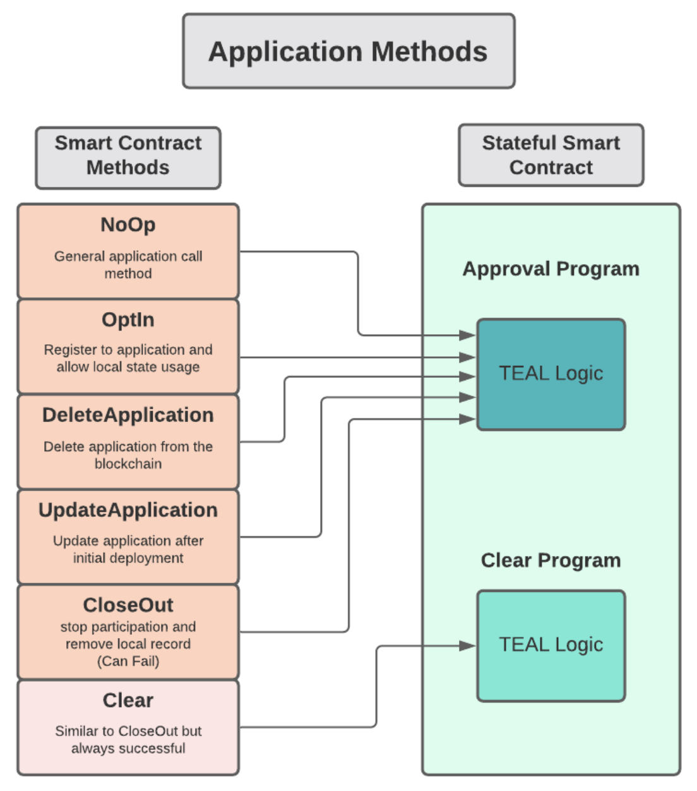

# Application Stack

The official Algorand implementation is written in Go, with a significant amount of the code, largely the actual cryptographic functions, such as hash functions, signing, verifying and so on written in C.

Algorand also provides 4 official SDKs for interacting with Algorand - Python, JavaScript, Go and Java.

## Storage

Storage is handled using the SQLite database. This was chosen as it provides excellent storage performance, is embedded, lightweight, and fault-tolerant. One drawback to this is a lack of control from a DB standpoint. There is little flexibility to optimize the database.

There is also a standalone REST API Data Store using PostgresSQL. This is called 'Indexer' and it is has it's own binary outside the Algorand node.

It is connected using an Algod process which runs on Archival nodes. These can be queried using the various SDKs that Algorand provide.


Here is an example of using the python SDK to query the last 1000 transactions that exceed 100 microAlgos:

```python
#/indexer/python/search_transactions_min_amount.py
response = myindexer.search_transactions(min_amount=100)
# Pretty Printing JSON string
print(json.dumps(response, indent=2, sort_keys=True))
```

Algod is one of two processes that nodes in algorand run. Algod is responsible for processing the protocol and interacting with SQLite to write records and implement REST API for reads.

The other is KMD (Key Manager Daemon) which handles all interactions with spending keys, including signing transactions.

## Network Communication

All messages in Algorand are encoded using MessagePack a binary serialization format that allows exchanges in languages like JSON.

The network operates in a mesh network using WebSockets over HTTP (TCP).

## Smart Contracts

Algorand uses TEAL (Transaction Execution Approval Language) to run smart contracts.

TEAL is a Turing-complete assembly-like language that’s processed in AVM (Algorand Virtual Machines) which supports looping, subroutines and has guardrails which limit contract execution time using a dynamic opcode cost evaluation algorithm.

The smart contracts can either be written in TEAL directly, or in pyTeal which generates TEAL code from Python code.

In TEAL there are always two programs - the Approval Program and the Clear Program. The Approval Program handles most of the business logic and the Clear Program handles closing the accounts.


