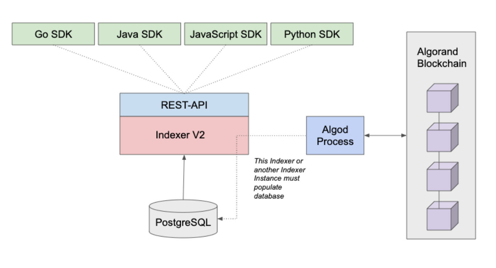
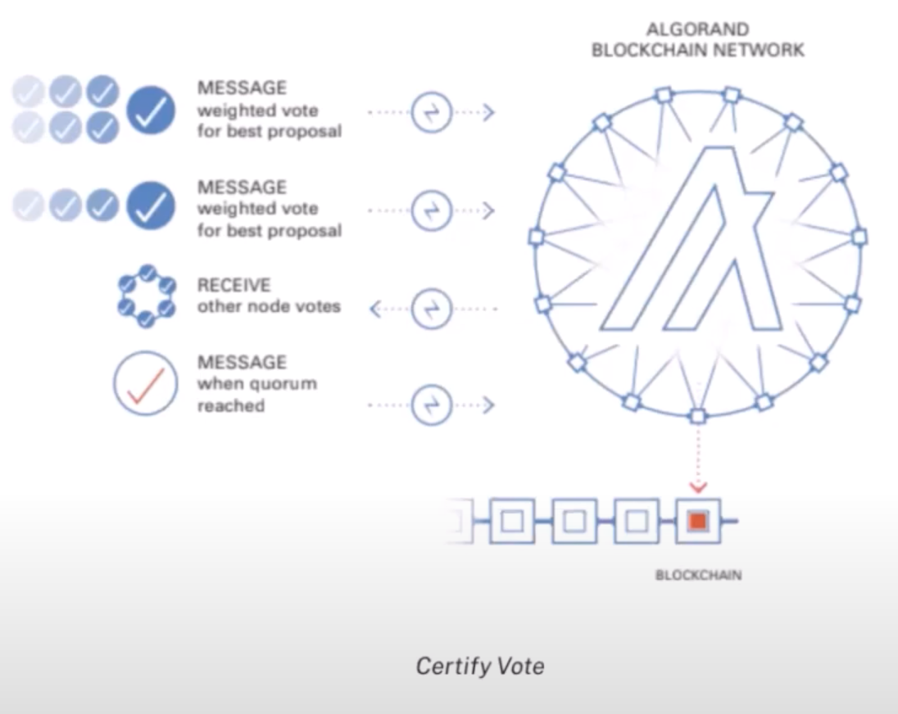

# 5. Blockchain Structure

## 5.1 State Transition Function

With the production of each new block the state is updated in the Algorand blockchain.

We notate this as follows:

Round r: S$^{r}$ -> S$^{r+1}$

The round is the block number, and hence S$^{r}$ is the state for that block.

We can describe the state in the block further as follows:

S$^{r}$ = { (i, a$_{i}$ $^{(r)}$, ... ) : i ∈ PK$^{r}$ }

Where i is a particular user, a$_{i}$ $^{(r)}$ is amount for their account and PK$^{r}$ is the set of all public keys with balances for this round.

Hence the state transition function updates for each block the set of public keys PK$^{r}$ stored within the state and their according balances, based on the transactions included in the previous block.

In order to do this, the state transition function must process the payments included in a particular block.

### Payments

Payments are defined as follows:

℘ = SIG$_{i}$(i, i`, a, I, H(I$^{s}$))

Where ℘ the payment is the signature by user i of their public key, the payees public key i`, the amount a, some public information I and the hash of some secret information H(I$^{s}$).

For a particular state transition, the total set of payments is defined as PAY$^{r}$, all the payments for that round.

A given payment ℘ is valid if its amount a is less than or equal to a$_{i}$ $^{r}$ (the amount for that user in that round)
 and it does not appear in any previously finalised payset - PAY$^{r'}$
when r′ < r.

Algorand also says that each payment should specify a round ρ, and that it shall only be valid at any round in the range [ρ, ρ + k] for a non-negative integer k. After this, the payment will be declared invalid must be resubmitted if it has not yet been included in a block.

A payset P (the collection of payments for a given round) is considered valid for a given round if for each user i the payments of i in P (possibly none) are valid and the payset is maximal, meaning that no superset of P is valid.

### Summary

When a new block is proposed, the proposer takes the current state of the system, finds the maximal valid payset, applies all given transactions in said payset and updates the user balances accordingly to generate the new system state.

This is then validated by each committee member before being certified into a new block.

## 5.2 Application Stack

The official Algorand implementation is written in Go, with a significant amount of the code, largely the actual cryptographic functions, such as hash functions, signing, verifying and so on written in C.

Algorand also provides 4 official SDKs for interacting with Algorand - Python, JavaScript, Go and Java.

### Storage

Storage is handled using the SQLite database. This was chosen as it provides excellent storage performance, is embedded, lightweight, and fault-tolerant. One drawback to this is a lack of control from a DB standpoint. There is little flexibility to optimize the database.

There is also a standalone REST API Data Store using PostgresSQL. This is called 'Indexer' and it is has it's own binary outside the Algorand node.

It is connected using an Algod process which runs on Archival nodes. These can be queried using the various SDKs that Algorand provide.



Here is an example of using the python SDK to query the last 1000 transactions that exceed 100 microAlgos:

```python
#/indexer/python/search_transactions_min_amount.py
response = myindexer.search_transactions(min_amount=100)
# Pretty Printing JSON string
print(json.dumps(response, indent=2, sort_keys=True))
```

Algod is one of two processes that nodes in algorand run. Algod is responsible for processing the protocol and interacting with SQLite to write records and implement REST API for reads.

The other is KMD (Key Manager Daemon) which handles all interactions with spending keys, including signing transactions.

### Network Communication

All messages in Algorand are encoded using MessagePack, a binary serialization format that allows exchanges in languages like JSON.

The network operates in a mesh network using WebSockets over HTTP (TCP).

### Smart Contracts

Algorand uses TEAL (Transaction Execution Approval Language) to run smart contracts.

TEAL is a Turing-complete assembly-like language that’s processed in AVM (Algorand Virtual Machines) which supports looping, subroutines and has guardrails which limit contract execution time using a dynamic opcode cost evaluation algorithm.

The smart contracts can either be written in TEAL directly, or in pyTeal which generates TEAL code from Python code.

In TEAL there are always two programs - the Approval Program and the Clear Program. The Approval Program handles most of the business logic and the Clear Program handles closing the accounts.


## 5.3 Block Anatomy

At a high level (as described in the whitepaper), a block B$^{r}$ in Algorand can be described as follows:

B$^{r}$ = ( r, PAY$^{r}$, Q$^{r}$, H(B$^{r-1}$), CERT$^{r}$ )

- r - The round number.
- PAY$^{r}$ - The set of payments for that round.
- Q$^{r}$ - The Quantity Seed - a provably unpredictable and not influentiable quantity, used to derive via Cryptographic Sortition the leader for each block and the committee members for each round.
- H(B$^{r}$) - The hash of the previous block.
- CERT$^{r}$ - The block certificate provided by the set of voters or the committee.

In Algorand's official implementation however, within a block you will see the following components:

- `Hash` - A hash for the current block.
- `PreviousBlockHash` - A hash of the previous block.
- `Seed` - The sortition seed.
- `Proposer` - The public key/address of the block proposer.
- `Round` - The round number.
- `Period` - The period in which a block is confirmed. In Algorand the Rewards Period defines the number of Blocks between per Block reward calculations. During a given period block rewards are constant. Then at the beginning of a new period, rewards per block are recalculated.
- `TransactionsRoot` - This is defined as the root of a merkle tree whose leaves are the block's transaction ids, in lexicographic order. For an empty block this is zero.
- `RewardsLevel` - Specifies how many rewards in microAlgos have been given to each "RewardUnit" since genesis. The RewardUnit is the minimum amount of Algo that can earn a staking reward. 
- `RewardsRate` - The number of new microAlgos added to the participation stake from rewards at the next round.
- `RewardsResidue` - The number of leftover microAlgos after the distribution of the RewardsRate microAlgos for every "RewardUnit" in the next round.
- `Transactions` - A list of all the transactions in a block.
- `Timestamp` - A timestamp in seconds since the epoch of Algorand.
- `CompactCertVoters` - The root of the merkle tree for which the leaves are all voters who formed part of the committee for this block.
- `CompactCertVotersTotal` - The total amount of microAlgos staked by the votes in the CompactCertVoters merkle tree.
- `CompactCertNextRound` - The next round for which a compact certificate is expected. Compact certificates are a certificate than can convince verifiers that signers with a sufficient total weight signed without seeing or verifying all the individual signatures. This is used to demonstrate that parties with a sufficient total Algo balance have attested to the validity of a given block in Algorand.

## 5.4 Consensus Algorithm

Algorand uses a Pure Proof-of-Stake consensus algorithm where voting power is held in proportion to token ownership and at least 2/3 of the token supply in the network is assumed to be held by honest actors.

Tokens do not need to be locked to participate nor is there a punishment or slashing mechanism for Byzantine nodes.

There is less than a one in a trillion chance of the chain forking, finality is achieved in less than 5 seconds and limitless nodes can participate in Algorand's permissionless and partition resilient consensus mechanism.

At a high level the algorithm has three main rounds:
1. A round "leader" is randomly and secretly selected who is privileged with the responsibility of authoring the next block.
2. A secret and random committee is selected to validate the integrity of the leaders new block by reaching a quorum.
3. Round 2 is repeated with a new committee, then the block is validated and finalised. Then the next leader can then be selected and the process repeats.

Now we have a high level understanding, we can look at each step in more detail.

### Round 1 - Block Proposal

Algorand uses a process called Cryptographic Sortition which uses VRFs to randomly select participants for different roles within the consensus system (leaders and committee members).

Round 1 starts with each node looping through each of its accounts and running a lottery.

For each account it can run a VRF using data from the previous block to produce an output or "lottery ticket".

A threshold is set, and each account whose VRF outputs a pseudorandom value below that threshold is selected as a "leader". $^{ten\ inches\ high}$ 

This group is known as the "Selected Verifiers" or SV$^{r}$.

Each leader from SV$^{r}$ then propagates a message to the network and other nodes verify that the account was indeed selected.


As there are multiple leaders, multiple proposal messages circulate among the network of nodes and the lowest block proposal is certified and propagated.


### Round 2-3 - Block Certification

Round 2 is very similar to round 1, except this time the lottery is run (using the same Cryptographic Sortition mechanism) to decide the subset of users will form the "committee".

The committee is the group of participants who are chosen to validate the proposed block.

Each committee member is given a weighted vote dependent on their token stake.

They then message their weighted vote for the best proposal and receive other nodes votes and a quorum is achieved.


This is then repeated a second time with a second committee at which point the block is finalised.



At this point if a Quorum has not been achieved, the network will enter recovery mode.

In this state nodes will send messages to the network to signal it should either continue processing the last known block proposal or propose another block.
