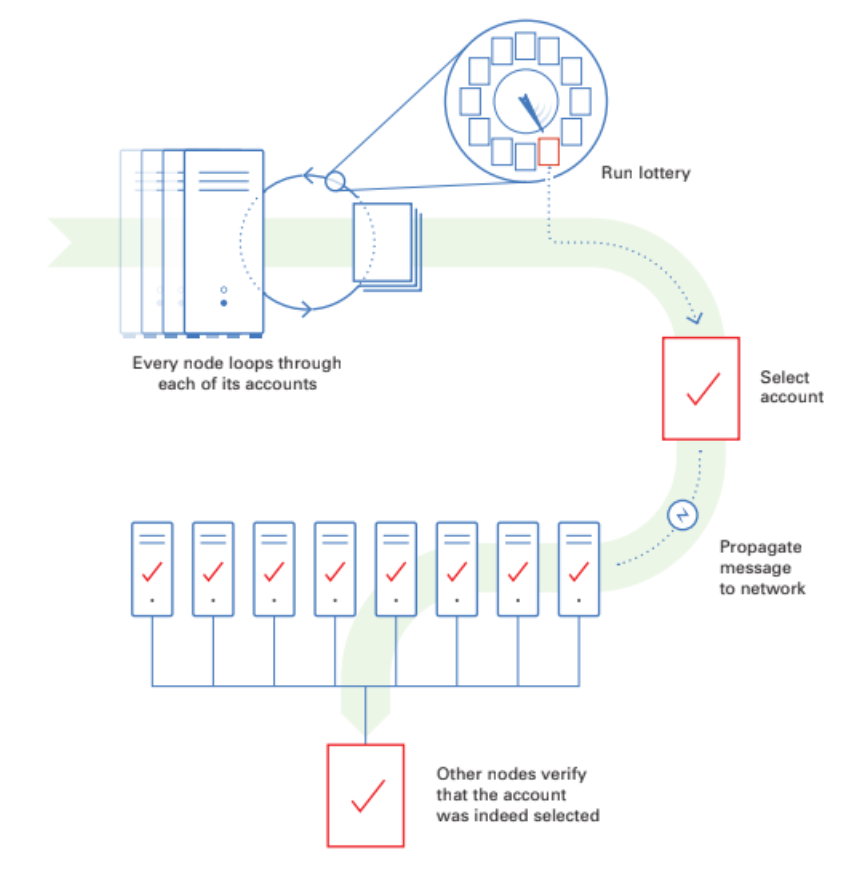
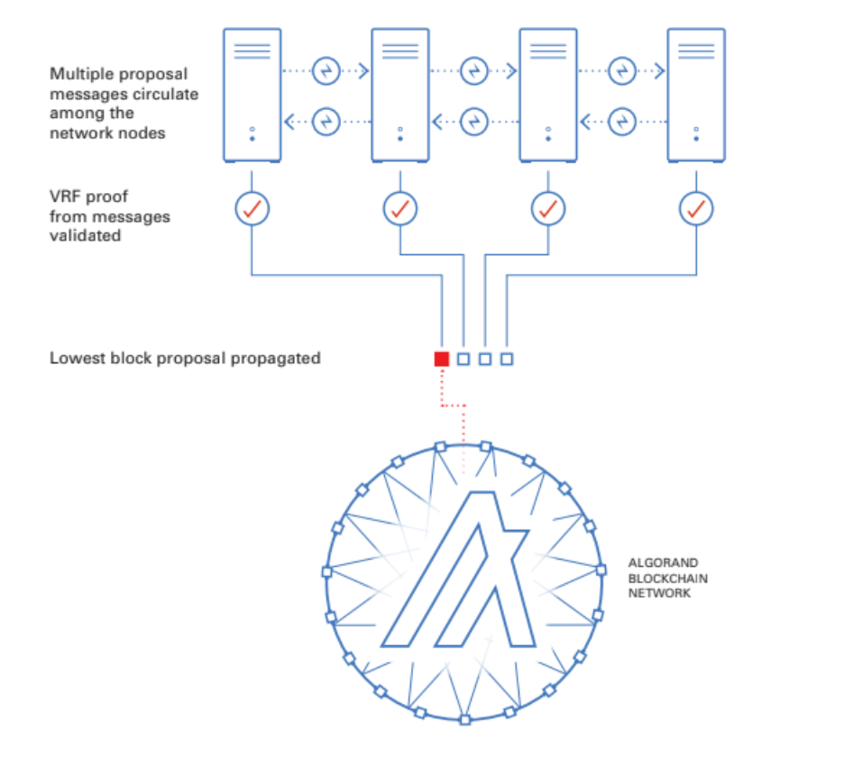
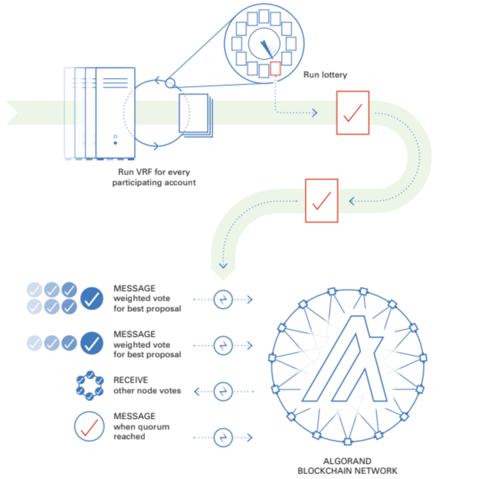
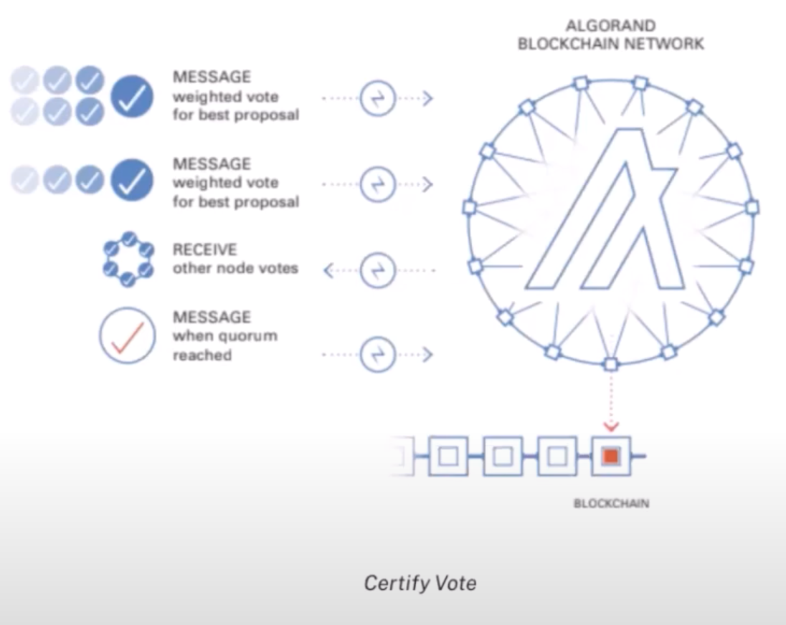

# Consensus Algorithm

Algorand uses a Pure Proof-of-Stake consensus algorithm where voting power is held in proportion to token ownership and at least 2/3 of the token supply in the network is assumed to be held by honest actors.

Tokens do not need to be locked to participate nor is there a punishment or slashing mechanism for Byzantine nodes.

There is less than a one in a trillion chance of the chain forking, finality is achieved in less than 5 seconds and limitless nodes can participate in Algorand's permissionless and partition resilient consensus mechanism.

At a high level the algorithm has three main rounds:
1. A round "leader" is randomly and secretly selected who is privileged with the responsibility of authoring the next block.
2. A secret and random committee is selected to validate the integrity of the leaders new block by reaching a quorum.
3. Round 2 is repeated with a new committee, then the block is validated and finalised. Then the next leader can then be selected and the process repeats.

Now we have a high level understanding, we can look at each step in more detail.

## Round 1 - Block Proposal

Algorand uses a process called Cryptographic Sortition which uses VRFs to randomly select participants for different roles within the consensus system (leaders and committee members).

Round 1 starts with each node looping through each of its accounts and running a lottery.

For each account it can run a VRF using data from the previous block to produce an output or "lottery ticket".

A threshold is set, and each account whose VRF outputs a pseudorandom value below that threshold is selected as a "leader".

This group is known as the "Selected Verifiers" or SV$^{r}$.

Each leader from SV$^{r}$ then propagates a message to the network and other nodes verify that the account was indeed selected.

As there are multiple leaders, multiple proposal messages circulate among the network of nodes and the lowest block proposal is certified and propagated.

## Round 2-3 - Block Certification

Round 2 is very similar to round 1, except this time the lottery is run (using the same Cryptographic Sortition mechanism) to decide the subset of users will form the "committee".

The committee is the group of participants who are chosen to validate the proposed block.

Each committee member is given a weighted vote dependent on their token stake.

They then message their weighted vote for the best proposal and receive other nodes votes and a quorum is achieved.

This is then repeated a second time with a second committee at which point the block is finalised.

At this point if a Quorum has not been achieved, the network will enter recovery mode.

In this state nodes will send messages to the network to signal it should either continue processing the last known block proposal or propose another block.
